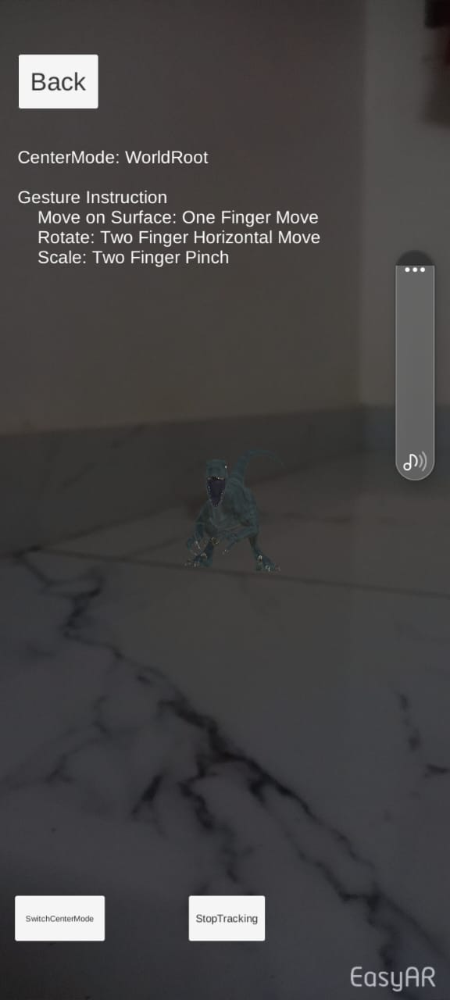
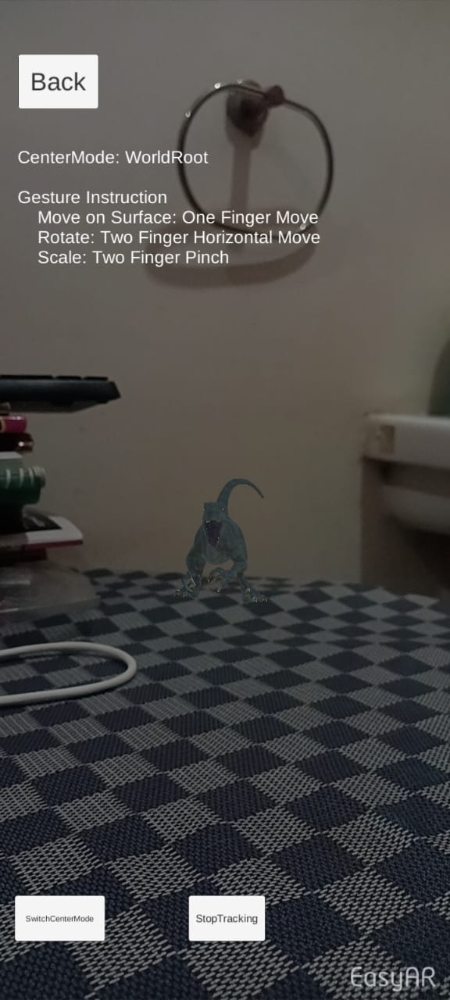

# Markerless Velociraptor Experiment

## Description
This experiment involves a markerless augmented reality application designed specifically for mobile devices. Upon pressing the "Start Tracking" button, users will be able to see a Velociraptor overlaid onto their surroundings through their device's camera. The Velociraptor will appear to be present in the real world environment, enhancing the user's experience with augmented reality.

## Features
- Markerless augmented reality: No need for physical markers, allowing for seamless integration of virtual objects into the real world.
- Velociraptor animation: Enjoy a realistic Velociraptor model that moves and behaves within the user's environment.
- Mobile compatibility: The application is designed to work on mobile devices, providing accessibility to a wide range of users.
- Easy to use: Simple controls make it easy for users to interact with the augmented reality experience.

## How to Play
1. Clone the repository to your local machine.
2. Open the project in Unity and make sure that the platform is switched to Android and then build the application.
3. Install the application on your mobile device.
4. Open the application and grant necessary permissions for camera access.
5. Press the "Start Tracking" button to initiate the markerless tracking.
6. Once tracking has started, aim your device's camera at a suitable surface.
7. The Velociraptor will appear in your environment.

## Controls
- Start Tracking Button: Initiates the markerless tracking, allowing the Velociraptor to appear in the user's environment.

## Screenshots

## Contributing

Feel free to contribute to the project by opening issues or creating pull requests. Follow the guidelines outlined in [CONTRIBUTING.md].

## License

This project is licensed under the [MIT License] - see the [LICENSE.md] file for details.
